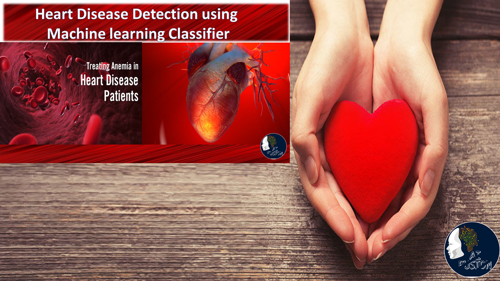

# heart-monitor
heart monitor web application that detects whether a person has heart disease or not.
**[Heart Monitor App](https://heartmonitorapp.herokuapp.com)**

#### Purpose
+ A productionized ML web app for hepatitis mortality prediction

#### Requirements
+ Flask
+ Pandas
+ Scikit-learn
+ Gunicorn
+ Numpy

#### Run locally on command prompt
+ Run this command `git clone https://github.com/itsafo/heart-monitor-app.git`
+ Go into the heart haven folder
+ Run `pip install -r requirements.txt` 
+ Run `export FLASK_APP=hello.py`
+ Run `flask run`

#### Tech Stack
+ Flask
+ Python
+ Heroku

#### Screenshot

#### Ref
Referenced git repo: <a href="https://github.com/prem-creator/heart-detector" target="_blank">AI Fusion - prem creator</a>
